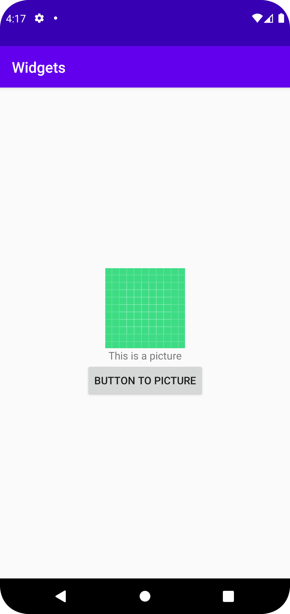

# Rapport

## Följande grundsyn gäller dugga-svar:

En constraint layout valdes att gjöras i deta projekt och den sates som wrap-content
```
<androidx.constraintlayout.widget.ConstraintLayout
    app:layout_constraintTop_toTopOf="parent"
    app:layout_constraintBottom_toBottomOf="parent"
    app:layout_constraintStart_toStartOf="parent"
    app:layout_constraintEnd_toEndOf="parent"
    android:layout_width="wrap_content"
    android:layout_height="wrap_content"
    tools:layout_editor_absoluteX="1dp"
    tools:layout_editor_absoluteY="1dp">

```

För de tre views som skule skapas så gjordes en ImgageView, TextView och Button.

MyImage är ImageViewen som är högs upp och har då PictureText som sin bottom constraint.
```
<ImageView
    android:id="@+id/MyImage"
    android:layout_width="200dp"
    android:layout_height="200dp"
    android:contentDescription="@string/PictureDescription"
    android:visibility="visible"
    app:layout_constraintTop_toTopOf="parent"
    app:layout_constraintBottom_toTopOf="@+id/PictureText"
    app:layout_constraintEnd_toEndOf="parent"
    app:layout_constraintStart_toStartOf="parent"
    app:srcCompat="@drawable/logo_bild_svg"
    android:layout_marginBottom="20dp"/>
```

PictureText är TextViewen som är i mitten så den får ha MyImage som sin top constraint 
och PictureButton som sin bottom constraint.
```
<TextView
    android:id="@+id/PictureText"
    android:layout_width="wrap_content"
    android:layout_height="wrap_content"
    android:layout_marginBottom="20dp"
    android:background="#4CAF50"
    android:text="@string/PictureText"
    android:visibility="visible"
    app:layout_constraintBottom_toTopOf="@+id/PictureButton"
    app:layout_constraintEnd_toEndOf="parent"
    app:layout_constraintStart_toStartOf="parent"
    app:layout_constraintTop_toBottomOf="@+id/MyImage" />
```

PictureButton är knappen som hamna längs ner och har då PictureText som sin top constraint.
```
<Button
    android:id="@+id/PictureButton"
    android:layout_width="wrap_content"
    android:layout_height="wrap_content"
    android:text="@string/PictureButtonText"
    app:layout_constraintTop_toBottomOf="@+id/PictureText"
    app:layout_constraintBottom_toBottomOf="parent"
    app:layout_constraintEnd_toEndOf="parent"
    app:layout_constraintStart_toStartOf="parent" />
```


